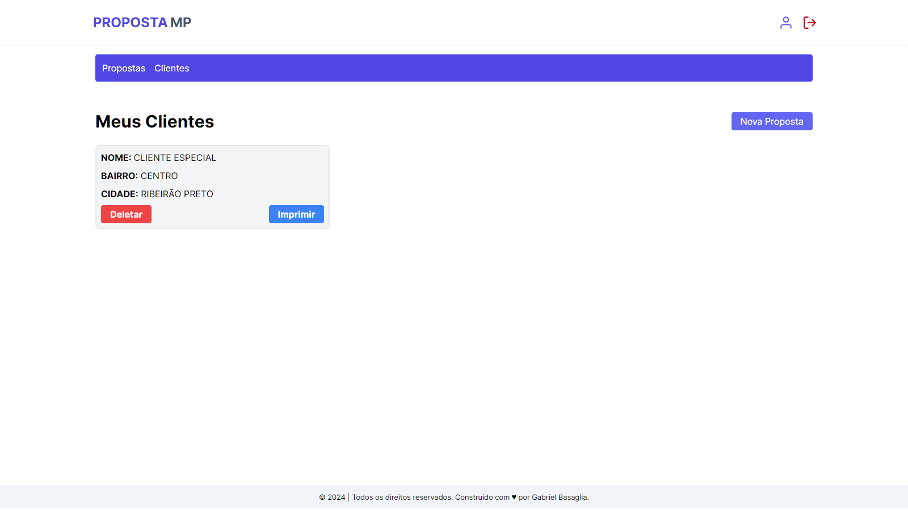
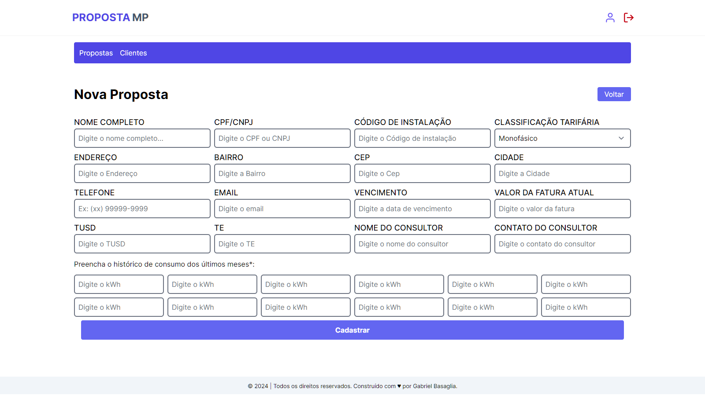
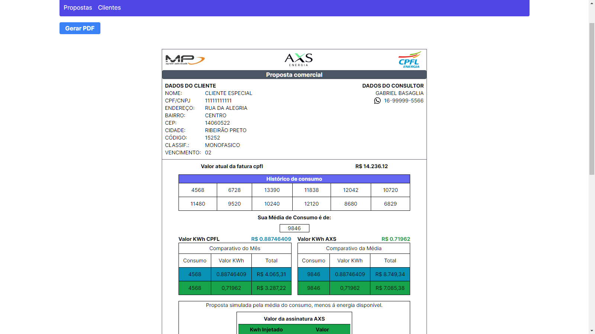
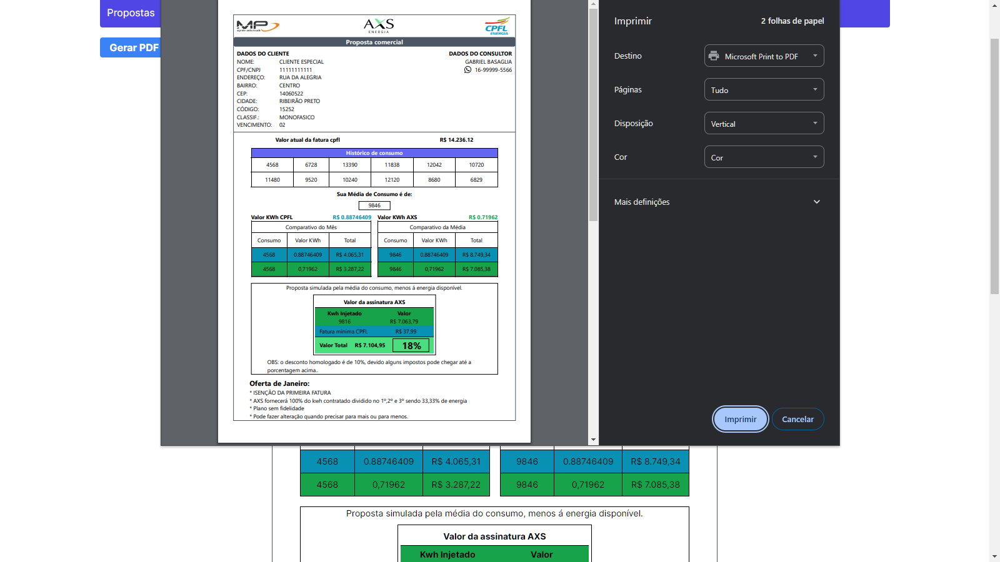
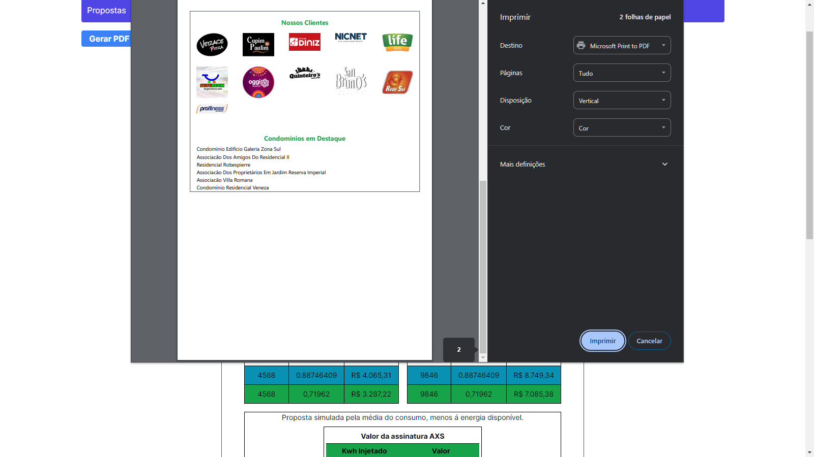

# Gerador de Proposta

# Screenshots 📷

Aqui estão algumas capturas de tela do Gerador de Proposta:

<div style="display: grid; grid-template-columns: repeat(3, 1fr); gap: 1px;">
  
  
  
  
  
  
</div> <br>

# Gerador de Proposta 📄

O **Gerador de Proposta** é uma aplicação desenvolvida para resolver a necessidade de criar propostas detalhadas, comparando o valor de energia atual com o valor de energia proposto, além de permitir o acompanhamento de clientes cadastrados.

## Funcionalidades 🚀

- Criação de propostas detalhadas.
- Comparação de consumo atual e proposto.
- Gerenciamento de clientes cadastrados.
- Acesso restrito para cada usuário, permitindo visualização apenas de seus próprios clientes.

## Tecnologias Utilizadas 🛠️

### Backend

- MongoDB
- Prisma
- Axios

### Frontend

- Nextjs
- React-hook-form para formulários.
- React-to-print para geração de PDF das propostas.
- Totalmente responsivo para utilização em qualquer tela.

## Instalação 📦

1. Clone o repositório:

   ```bash
   git clone https://github.com/gabrielbasaglia/gerador-de-proposta.git
   ```
